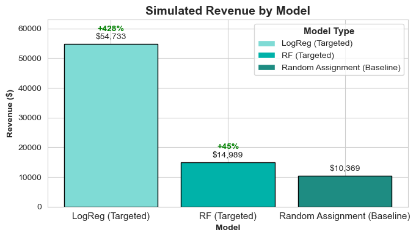
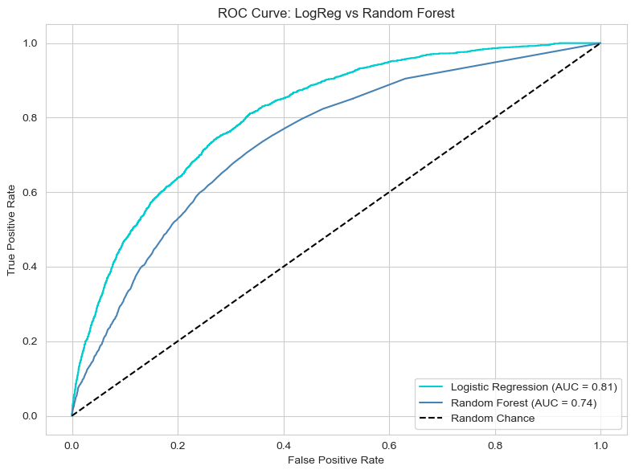

# 📊 ***From Random to Relevant:* A Predictive Asset Targeting Study**
### A Predictive Asset Targeting Study for Healthline

---

## 🧠 Problem Statement

Healthline currently uses a random asset assignment strategy for visitors. While this ensures broad exposure across content, it overlooks available user signals, potentially limiting both conversion rates and total revenue.

This project investigates whether predictive modeling can improve outcomes by recommending the asset most likely to convert for each user session.

---

## 📁 Project Structure

```plaintext
healthline-asset-optimization/
├── data/
│   └── Case_Material.xlsx            # Provided dataset
├── figures/
│   ├── ROC_curve.png                 # ROC curve visualization
│   └── Sim_reve.png 
├── notebooks/
│   └── healthline_analysis.ipynb     # Full analysis notebook
├── README.md                         # This file
```

---

## 🧪 Methodology Overview

### 1. Exploratory Data Analysis (EDA)
Key findings from the data:
- **Asset x Diagnosis:**
  - **Asset C** leads with the **highest conversion rates (~17%)**, particularly for **Ulcerative Colitis** and **Unknown-diagnosis** users.
  - Unknown users still convert meaningfully, showing that **behavioral signals alone** can drive personalization.
- **Device Type:**
  - Conversion rates are **similar across devices**, with **mobile slightly ahead** of desktop/tablet.  
  - Device type adds **limited predictive value** on its own but can help in combination with other features.
- **Time of Day:**
  - **Assets A & C** perform best in the **afternoon**, **Asset B** peaks in the **evening**, suggesting **timing influences conversion effectiveness**.
    
> 📌 **Implication:** Personalization opportunities exist even with incomplete profiles, especially when factoring in **diagnosis context and timing**.

---

### 2. Asset Value Analysis *(Business Impact)*
- **Asset A:** Generates the **highest total revenue** (~$10K baseline) via higher volume despite $5 per-conversion payout.  
- **Asset B:** Highest **value per conversion ($7)** but limited reach → lower total dollars.  
- **Asset C:** Converts best (~20% CVR) but its **$2.50 payout** caps total revenue (~$5.3K).

> 💡 **Takeaway:** Asset strategy must optimize for **expected value (CVR × payout)** to avoid over-serving low-payout assets.

---

### 3. Predictive Modeling & Revenue Simulation

Two models were evaluated to predict which asset maximizes **expected revenue per session**:

| Model                | Baseline Rev. | Simulated Rev. | Lift ($)    | Lift (%)     |
|---------------------|---------------|----------------|-------------|--------------|
| Logistic Regression | $10,369.00    | $54,732.64     | $44,363.64  | **+427.9%**  |
| Random Forest       | $10,369.00    | $14,989.20     | $4,620.20   | **+44.6%**   |

- **Logistic Regression:** Simpler decision boundary → **more aggressive targeting**, higher simulated lift but potentially overfits.  
- **Random Forest:** **More conservative**, calibrated probabilities, delivers a **realistic +44% uplift** vs. random assignment.



---

## 📈 ROC Curve Performance



ROC curves validate model quality:

- **Logistic Regression:** AUC = **0.81** → strong separation of converters/non-converters.  
- **Random Forest:** AUC = **0.74** → lower but still predictive above random chance.

> 📈 Both models provide meaningful predictive power for dynamic asset allocation.

---

## ✅ Conclusion & Recommended Actions

Predictive modeling offers a **substantial improvement** over random asset assignment, with even conservative approaches delivering **+44% revenue uplift**.

### 📌 Next Steps

1. **Deploy contextual asset serving** using diagnosis, engagement, device, and time features.  
2. **Optimize for expected value**, not just conversion rate, to maximize ROI.  
3. **Run controlled experiments** (A/B tests) comparing model-driven vs. random assignment.  
4. **Monitor performance** over time for model drift and changing asset economics.

---

## 🔧 Tech Stack

- Python (Pandas, NumPy, Scikit-learn, Seaborn, Matplotlib)
- Jupyter Notebook
- Git & GitHub for version control and collaboration

---

## 📓 Notebook
See the full analysis in [`notebooks/healthline_analysis.ipynb`](notebooks/healthline_analysis.ipynb)

---

## 👤 Author

**Alyssa Day**  
*Data Science | Artificial Intelligence | Strategy & Impact*

[GitHub](https://github.com/yourusername) • [LinkedIn](https://www.linkedin.com/in/yourprofile)
